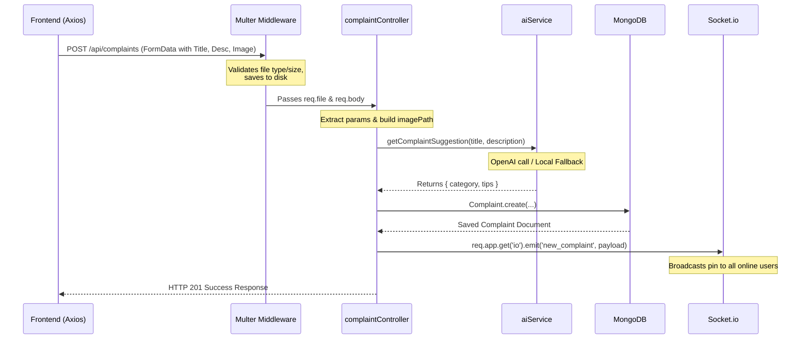

# 🎓 Interview Preparation Guide: Smart Waste Management System

This guide contains detailed, explanatory answers to the interview questions tailored to your project. These answers are designed to showcase depth, practical experience, and conceptual clarity to help you sound like an experienced developer.

---

## 1. Freshers & Foundation Questions (Tech Stack & Architecture)

### Q1: Can you explain how you structured your backend code (routes, controllers, models, services, middlewares) and the benefits of keeping business logic in services (like [aiService.js](file:///e:/learnreactvite/Smart%20Waste%20management/Smart%20waste%20management%20Website%20Claude%20-%20Copy/backend/src/services/aiService.js) and [smsService.js](file:///e:/learnreactvite/Smart%20Waste%20management/Smart%20waste%20management%20Website%20Claude%20-%20Copy/backend/src/services/smsService.js)) rather than in the controllers?

#### **Answer:**
The backend is structured according to the **MVC (Model-View-Controller)** pattern plus a **Service Layer**, which is a standard enterprise-level architecture pattern.
- **Routes**: Define API endpoints and apply endpoint-specific middleware (like authentication and rate limiters).
- **Controllers**: Responsible for parsing HTTP requests (extracting parameters, headers, and body), calling the appropriate business logic layer, and returning the HTTP response with status codes.
- **Models**: Define the database schema, validations, indexes, and hooks using Mongoose.
- **Middlewares**: Intercept requests to perform cross-cutting concerns (authentication, rate-limiting, error handling, file parsing).
- **Services**: Encapsulate pure business logic, calculations, and integrations with external APIs (like OpenAI GPT, Nodemailer, Twilio).

**Benefits of Service Layer separation:**
1. **Single Responsibility Principle (SRP)**: Controllers focus only on HTTP concerns. If we want to change from using REST API to GraphQL, or trigger actions from a CLI script, we can reuse the same services without changing the controllers.
2. **Reusability and Dry Principle**: Code like `sendSMS` or `getComplaintSuggestion` is used in multiple places (auth, complaint routes, admin actions). Keeping it in services prevents code duplication.
3. **Mocking and Unit Testing**: We can write unit tests for `aiService.js` by mocking the OpenAI client directly, without needing to spin up an Express HTTP server or write mock requests.

---

### Q2: Why did you choose React Context API (e.g., `AuthContext`, `ToastContext`) over a library like Redux? In what scenario would you decide to migrate this project to Redux or Zustand?

#### **Answer:**
For a project of this scale, the **React Context API** is the ideal choice.
- **Minimal Boilerplate**: Redux requires actions, reducers, store configuration, and selectors, which introduces unnecessary complexity for a simple dashboard application.
- **Scope of State**: Our global states are relatively simple:
  - User Authentication state (`AuthContext`)
  - Shared toast notifications (`ToastContext`)
  - Live socket notifications (`NotificationContext` / `ComplaintContext`)
- **Built-in React Feature**: No extra bundle size is added, keeping the application lightweight.

**When to migrate to Redux / Zustand:**
1. **High-Frequency State Updates**: The Context API triggers a re-render for *all* consumer components whenever the context value object changes. In contrast, Redux and Zustand use selectors to trigger re-renders *only* if the specific slice of state changes. If we introduce features like real-time interactive mapping dashboards or heavy text editors where state changes with every keystroke, Context API will suffer from performance bottlenecks.
2. **Complex State Dependencies**: If multiple features rely on complex, interdependent status flows (e.g., calculating intermediate steps of complaints processing with history undo/redo features), Redux's middleware system (like Redux Toolkit or Saga) makes managing side effects much cleaner.

---

### Q3: Explain the difference between JWT authentication and Session-based authentication. Why is JWT a better fit for this project? Where is the token stored on the frontend, and how do you attach it to HTTP requests?

#### **Answer:**
- **Session-Based Authentication**: The server stores a session ID in its memory or database and sends a cookie to the client. On every request, the server reads the cookie, matches the ID with the session store, and populates user info. This is **stateful**.
- **JWT (JSON Web Token) Authentication**: The server signs a payload containing the user's ID and role using a secret key, then sends the encrypted token back to the client. The client stores it and attaches it to headers. The server decrypts it using the secret key without checking database records. This is **stateless**.

**Why JWT is better here:**
1. **Scalability**: Because JWT is stateless, we can deploy multiple instances of our backend API on services like Render without setting up a centralized session database (like Redis) or utilizing sticky sessions on load balancers.
2. **Cross-Origin support**: JWTs are easier to use across different domains and subdomains (e.g., separating the admin frontend, mobile app, and backend APIs) without dealing with complex cross-site cookie restrictions.

**Storage and Transmission:**
- **Storage**: The JWT is stored in the browser's `localStorage` or `sessionStorage` (or ideally, inside an `httpOnly`, `Secure`, `SameSite=Strict` Cookie to prevent XSS attacks).
- **Transmission**: The frontend utilizes an Axios interceptor (configured in `frontend/src/services/api.js`) to read the token from storage and attach it as a bearer token in the `Authorization` header: `Authorization: Bearer <TOKEN>`.

---

### Q4: How does your passport configuration in [passport.js](file:///e:/learnreactvite/Smart%20Waste%20management/Smart%20waste%20management%20Website%20Claude%20-%20Copy/backend/src/config/passport.js) handle account merging if a user registers using credentials first and later tries to log in using Google OAuth?

#### **Answer:**
Our Google strategy in [passport.js](file:///e:/learnreactvite/Smart%20Waste%20management/Smart%20waste%20management%20Website%20Claude%20-%20Copy/backend/src/config/passport.js) implements **automatic account merging** based on the email address:

1. **Step 1**: It first queries MongoDB to see if there is already a user registered with the unique `googleId` returned by Google: `let user = await User.findOne({ googleId: profile.id });`
2. **Step 2**: If no user matches the `googleId`, it performs a second query using the email address returned in the Google profile: `user = await User.findOne({ email: profile.emails[0].value });`
3. **Step 3 (The Merge)**: If it finds a user with that email, it assumes the user is logging in using their Google account for the first time but already has a local account. It updates the existing document with `googleId = profile.id` and merges the `avatar` URL:
   ```javascript
   user.googleId = profile.id;
   user.avatar = profile.photos[0]?.value;
   await user.save();
   ```
4. **Step 4**: If no user matches either the `googleId` or the `email`, a brand new user document is created.

This prevents the creation of duplicate accounts for the same email address and merges authentication vectors seamlessly.

---

## 2. Feature Flow-Based Questions

### Q1: Walk me through the step-by-step execution flow when a user uploads an image and submits a complaint via `createComplaint` in [complaintController.js](file:///e:/learnreactvite/Smart%20Waste%20management/Smart%20waste%20management%20Website%20Claude%20-%20Copy/backend/src/controllers/complaintController.js).

#### **Answer:**


1. **Frontend Request**: The React UI gathers input values and the uploaded image file. It packages them into a `FormData` object (necessary for multipart boundary file transmissions) and fires a `POST` request to `/api/complaints`.
2. **Middleware Interception**: The `upload.single('image')` middleware (configured in [upload.middleware.js](file:///e:/learnreactvite/Smart%20Waste%20management/Smart%20waste%20management%20Website%20Claude%20-%20Copy/backend/src/middlewares/upload.middleware.js)) catches the request, validates the extension and mime type, streams the file data to the `backend/src/uploads/complaints/` directory, and sets `req.file` with the path details.
3. **AI Processing**: Inside the controller, we trigger `getComplaintSuggestion(title, description)` asynchronously. If the OpenAI key is active, it prompts `gpt-3.5-turbo` to return a JSON array containing the categorized waste bucket and three safety tips. If it fails, our keyword-based regex search runs instead.
4. **Database Write**: The backend creates a new document in MongoDB using `Complaint.create()`. It records details including geolocation, category, anonymous flags, timelines, and the AI suggestion.
5. **Real-time Broadcast**: The server extracts the `io` instance from `req.app` and invokes `io.emit('new_complaint', payload)` to broadcast this new pin to all online clients currently looking at the map view.
6. **HTTP Response**: The API responds with a `201 Created` status containing the complaint record.

---

### Q2: Explain the data flow of the Map View feature. How does the frontend [MapView.jsx](file:///e:/learnreactvite/Smart%20Waste%20management/Smart%20waste%20management%20Website%20Claude%20-%20Copy/frontend/src/pages/MapView.jsx) hook into WebSockets using Socket.io?

#### **Answer:**
1. **Component Initialization**: When [MapView.jsx](file:///e:/learnreactvite/Smart%20Waste%20management/Smart%20waste%20management%20Website%20Claude%20-%20Copy/frontend/src/pages/MapView.jsx) mounts, it loads the Leaflet map container and calls `api.get('/complaints/nearby?lat=...&lng=...&radius=100000')` to render existing active complaints.
2. **WebSocket Connection**: The component consumes the `useSocket()` hook, establishing a TCP handshake connection with the Node server.
3. **Event Listener Registration**: An effect register listeners for the `new_complaint` event:
   ```javascript
   socket.on('new_complaint', handleNewComplaint);
   ```
4. **Incoming Event Handling**: When a new complaint is filed elsewhere:
   - The server pushes a `new_complaint` socket message containing the coordinates and title.
   - The browser receives this event. The handler adds the new marker to the `liveComplaints` state array.
   - An alert toast is displayed: `toast.info("New complaint filed: ...")`.
   - The map triggers a dynamic viewport transition: `map.flyTo([lat, lng])` centering the camera on the newly filed issue.
5. **Unmount Cleanup**: When leaving the Map page, the cleanup function runs:
   ```javascript
   return () => socket.off('new_complaint', handleNewComplaint);
   ```
   This prevents lingering listener references in memory, preventing redundant updates and performance lag.

---

### Q3: Walk me through the E-waste pickup lifecycle. How is a schedule request created, how does an admin see it, how is it confirmed, and what notifications are sent to the user?

#### **Answer:**
1. **Creation**:
   - The user fills out the request form on the `EWasteRequest` page (specifying address, dates, timeslots, and category types like laptop or batteries).
   - This fires a `POST` request to `/api/ewaste`.
   - The backend validates the inputs, records the coordinates, and creates a document in MongoDB with a default status of `requested`.
2. **Admin Verification**:
   - The Admin accesses the Admin Dashboard.
   - The frontend requests `/api/admin/ewaste` which executes `getAllPickups` in [adminController.js](file:///e:/learnreactvite/Smart%20Waste%20management/Smart%20waste%20management%20Website%20Claude%20-%20Copy/backend/src/controllers/adminController.js) with pagination.
   - The admin views the pickup parameters, assigns notes, and decides to approve the request by triggering a status update.
3. **Status Update & Alert dispatching**:
   - Admin updates the status to `confirmed` or `picked_up` via a `PUT` request to `/api/admin/ewaste/:id`.
   - In `updatePickupByAdmin`, the database record is updated.
   - The system initiates asynchronous operations:
     - Creates an in-app database notification via `notifyEwasteUpdate()`.
     - Sends a real-time message to the frontend client via Socket.io.
     - Sends an SMS via `sendPickupSMS(phone, date)` through Twilio to confirm the pickup.

---

## 3. Scenario-Based & Case-Based Questions

### Q1: What happens to your system if the OpenAI API key or Twilio credentials are not set or if these services experience downtime? How did you design fallbacks?

#### **Answer:**
API outages are a common reality in production. I designed the backend to be **fault-tolerant** and fail gracefully so that core operations are never blocked by external APIs.

1. **AI Service Fallback**:
   - In [aiService.js](file:///e:/learnreactvite/Smart%20Waste%20management/Smart%20waste%20management%20Website%20Claude%20-%20Copy/backend/src/services/aiService.js), if the environmental variable `OPENAI_API_KEY` is undefined, the code bypasses OpenAI immediately and redirects execution to `getFallbackSuggestion()`.
   - If the API key is present but a request fails due to rate limits or network issues, a `try-catch` block catches the exception, logs a warning via our winston logger, and invokes the same keyword-based static fallback:
     ```javascript
     try {
       // calls OpenAI client
     } catch (error) {
       logger.warn('AI suggestion failed, using fallback:', error.message);
       return getFallbackSuggestion(title, description);
     }
     ```
   - The keyword fallback runs regex checks on the text (e.g. searching for "drain" to classify under `drainage_blockage` and fetching pre-configured municipal tips).
2. **SMS Service Fallback**:
   - In `smsService.js`, the Twilio client is lazily configured. If the configuration is missing, it simply prints a logger warning and resolves the promise successfully: `logger.warn('SMS skipped (Twilio not configured)')`. This prevents backend crashes when sending notifications.

---

### Q2: In [complaintController.js](file:///e:/learnreactvite/Smart%20Waste%20management/Smart%20waste%20management%20Website%20Claude%20-%20Copy/backend/src/controllers/complaintController.js), you support anonymous waste reports. How do you prevent standard users from finding who filed an anonymous complaint, and how did you configure the Socket.io payload?

#### **Answer:**
Privacy is key when reporting local issues. We must strip identifiable fields of the reporter on public queries.

1. **Database Schema Setup**:
   - The [Complaint.js](file:///e:/learnreactvite/Smart%20Waste%20management/Smart%20waste%20management%20Website%20Claude%20-%20Copy/backend/src/models/Complaint.js) schema has an `isAnonymous` Boolean flag.
2. **Socket.io Payload Sanitization**:
   - When broadcasting a new complaint event (`new_complaint`), the controller sanitizes the payload before sending it to Socket.io:
     ```javascript
     io.emit('new_complaint', {
       _id: complaint._id,
       ...,
       userId: complaint.isAnonymous ? null : complaint.userId,
     });
     ```
   - If the complaint is anonymous, `userId` is set to `null` to ensure client web sockets cannot read user IDs or emails from network packets.
3. **Single Complaint Fetch Restrictions**:
   - In `getComplaintById` in [complaintController.js](file:///e:/learnreactvite/Smart%20Waste%20management/Smart%20waste%20management%20Website%20Claude%20-%20Copy/backend/src/controllers/complaintController.js), if the user is not an admin and is requesting a complaint filed by someone else, access is denied (HTTP 403):
     ```javascript
     if (req.user.role !== 'admin' && complaint.userId._id.toString() !== req.user._id.toString()) {
       return sendError(res, 'Access denied.', 403);
     }
     ```
     This prevents users from tampering with or viewing other citizens' records.

---

### Q3: What happens if two admins attempt to update or assign the same complaint status simultaneously? How does Node/Mongoose protect against race conditions?

#### **Answer:**
If two admins retrieve the same record, edit different fields, and save, the save operation that finishes last might overwrite the edits of the first admin. This is known as a **Lost Update anomaly**.

**How Mongoose handles this:**
- Mongoose schemas automatically include a version key (`__v`) on documents.
- When you execute `complaint.save()`, Mongoose compiles an update query equivalent to:
  ```sql
  UPDATE complaints SET status = 'in_progress', __v = __v + 1 WHERE id = XYZ AND __v = 0;
  ```
- If Admin B saved the document first, the version in the database becomes `1`. When Admin A's query runs, the database finds 0 matching documents matching `__v = 0`.
- Mongoose detects that no document was updated and throws a `VersionError` (Optimistic Locking). The developer can catch this error and tell Admin A: *"This document has been modified by another user. Please refresh and try again."*

**How to bypass this (Atomic Updates):**
- If you use `Complaint.findByIdAndUpdate()` or update operations with MongoDB operators (like `$set`), Mongoose bypasses full document saving and executes a direct update. This avoids version checks but is susceptible to silent overwrites if fields collide.

---

## 4. Edge Case-Based Questions

### Q1: If a user uploads an invalid file type or a massive 15MB file, how does your [upload.middleware.js](file:///e:/learnreactvite/Smart%20Waste%20management/Smart%20waste%20management%20Website%20Claude%20-%20Copy/backend/src/middlewares/upload.middleware.js) intercept it, and how does your Express server handle the error?

#### **Answer:**
We protect our server from storage flooding and malicious scripts by configuring Multer's limits and filtering options:

1. **File Type Filter**:
   - In [upload.middleware.js](file:///e:/learnreactvite/Smart%20Waste%20management/Smart%20waste%20management%20Website%20Claude%20-%20Copy/backend/src/middlewares/upload.middleware.js), `fileFilter` performs checks on both the file name extension and the MIME type using a regular expression:
     ```javascript
     const allowedTypes = /jpeg|jpg|png|webp|gif/;
     const extOk  = allowedTypes.test(path.extname(file.originalname).toLowerCase());
     const mimeOk = allowedTypes.test(file.mimetype.replace('image/', ''));
     ```
   - If a malicious user renames a `.sh` file to `script.jpg`, the extension check passes, but the `file.mimetype` (detected from file headers during multi-part upload parsing) will still report `application/x-sh` or `text/x-shellscript`, failing the `mimeOk` check. The callback returns an error, preventing the upload.
2. **File Size Filter**:
   - The Multer instance specifies limits:
     ```javascript
     limits: { fileSize: parseInt(process.env.MAX_FILE_SIZE) || 5 * 1024 * 1024 }
     ```
   - Any file larger than 5MB triggers an immediate exception.
3. **Graceful Error Handling Wrapper**:
   - We wrap Multer's executor inside a middleware function `handleUpload`:
     ```javascript
     if (err instanceof multer.MulterError) {
       if (err.code === 'LIMIT_FILE_SIZE') {
         return sendError(res, 'File size exceeds the 5 MB limit.', 400);
       }
       return sendError(res, `Upload error: ${err.message}`, 400);
     }
     ```
     This intercepts the error and returns a clean JSON error response rather than crashing the request or spilling raw stack traces to the client.

---

### Q2: The README claims users earn Eco Points when their complaints are resolved. However, looking at the admin resolution logic in [adminController.js](file:///e:/learnreactvite/Smart%20Waste%20management/Smart%20waste%20management%20Website%20Claude%20-%20Copy/backend/src/controllers/adminController.js), there is no database write to increment the user's `ecoPoints` on the [User.js](file:///e:/learnreactvite/Smart%20Waste%20management/Smart%20waste%20management%20Website%20Claude%20-%20Copy/backend/src/models/User.js) document. How would you implement this feature, and how would you use Mongoose database transactions?

#### **Answer:**
*This is a great talking point. Finding this discrepancy between documentation and code proves you actually understand the codebase inside and out.*

#### **Why Transactions are needed:**
Awarding Eco Points involves updating **two separate collections**:
1. Changing the status in the `complaints` collection.
2. Incrementing `ecoPoints` in the `users` collection.

If we write this updates sequentially without a transaction, and the server crashes *after* updating the complaint but *before* adding points, the data becomes inconsistent. The user's complaint is resolved, but they never get their points.

#### **How to implement it using Mongoose Transactions:**
```javascript
const mongoose = require('mongoose');

const updateComplaintByAdmin = async (req, res, next) => {
  // 1. Start a Session
  const session = await mongoose.startSession();
  
  try {
    // 2. Start Transaction
    session.startTransaction();
    
    const { status, adminNotes } = req.body;
    
    // Retrieve complaint inside transaction session
    const complaint = await Complaint.findById(req.params.id)
      .populate('userId')
      .session(session);
      
    if (!complaint) {
      await session.abortTransaction();
      return sendError(res, 'Complaint not found.', 404);
    }
    
    const oldStatus = complaint.status;
    if (status) complaint.status = status;
    if (adminNotes) complaint.adminNotes = adminNotes;
    
    // Check if status changed to resolved
    if (status === 'resolved' && oldStatus !== 'resolved') {
      // Award 10 Eco Points to the owner
      await User.findByIdAndUpdate(
        complaint.userId._id,
        { $inc: { ecoPoints: 10 } },
        { session, new: true }
      );
      
      complaint.timeline.push({
        status: 'resolved',
        message: 'Complaint resolved. 10 Eco Points awarded!',
        updatedBy: req.user._id
      });
    }
    
    await complaint.save({ session });
    
    // 3. Commit all changes to the database
    await session.commitTransaction();
    session.endSession();
    
    return sendSuccess(res, { complaint }, 'Complaint resolved and points awarded.');
  } catch (error) {
    // 4. Rollback database changes on any error
    await session.abortTransaction();
    session.endSession();
    next(error);
  }
};
```

---

### Q3: What happens in [MapView.jsx](file:///e:/learnreactvite/Smart%20Waste%20management/Smart%20waste%20management%20Website%20Claude%20-%20Copy/frontend/src/pages/MapView.jsx) if a user denies location permissions to the browser? How does the Map component react, and does the UI show a fallback state?

#### **Answer:**
In [MapView.jsx](file:///e:/learnreactvite/Smart%20Waste%20management/Smart%20waste%20management%20Website%20Claude%20-%20Copy/frontend/src/pages/MapView.jsx) lines 143-165, the user coordinates are retrieved using `navigator.geolocation.getCurrentPosition()`.

1. **Denial Flow**:
   - If the user rejects the browser prompt, the error callback of `getCurrentPosition` triggers.
   - Currently, it prints an error console warning or shows a basic alert.
   - The page falls back to using **India's center coordinates** (`[20.5937, 78.9629]`) set in `fetchGlobalComplaints` to load overall global complaints.
2. **UX Improvements**:
   - To make it premium, we can catch the error codes (e.g. `error.PERMISSION_DENIED`) and display a clean custom alert banner instructing the user how to re-enable location settings, or fallback to an IP-address-based geolocator service (like IP-API or Cloudflare headers).

---

## 5. Optimization-Based Questions

### Q1: In `getNearbyComplaints` in [complaintController.js](file:///e:/learnreactvite/Smart%20Waste%20management/Smart%20waste%20management%20Website%20Claude%20-%20Copy/backend/src/controllers/complaintController.js), a simple bounding box calculation is used to filter coordinates. Why was this chosen over MongoDB's native geospatial capabilities? How would you optimize this using a GeoJSON `2dsphere` index and geospatial operators?

#### **Answer:**
The current implementation uses a **bounding box approximation**:
```javascript
const latRange = parseFloat(radius) / 111;
const lngRange = parseFloat(radius) / (111 * Math.cos((parseFloat(lat) * Math.PI) / 180));
```
This filters complaints using simple comparison checks on numbers: `lat` between `lat - latRange` and `lat + latRange`.

**Why it was chosen:**
- It is incredibly simple and runs on any standard database index without needing specialized geospatial schemas or index types.

**Limitations:**
- It approximates a rectangle instead of a true circle (radius).
- It breaks down near the Earth's poles and the International Date Line due to coordinate wrapping.

**How to optimize it using MongoDB Geospatial indexing:**
1. **Schema Update**: Represent coordinates as a GeoJSON Point in the schema:
   ```javascript
   location: {
     type: { type: String, enum: ['Point'], default: 'Point' },
     coordinates: { type: [Number], required: true } // [longitude, latitude] format
   }
   ```
2. **Index creation**: Apply a `2dsphere` index:
   ```javascript
   ComplaintSchema.index({ location: '2dsphere' });
   ```
3. **Query Optimization**: Use the `$near` operator:
   ```javascript
   const complaints = await Complaint.find({
     location: {
       $near: {
         $geometry: { type: 'Point', coordinates: [parseFloat(lng), parseFloat(lat)] },
         $maxDistance: radius * 1000 // converted to meters
       }
     }
   });
   ```
This indexes locations as spherical coordinate points, executing distance calculations instantly using spatial indices.

---

### Q2: You have configured in-memory API rate-limiting in [rateLimiter.js](file:///e:/learnreactvite/Smart%20Waste%20management/Smart%20waste%20management%20Website%20Claude%20-%20Copy/backend/src/middlewares/rateLimiter.js). If this app is scaled horizontally to 4 server instances behind a load balancer, how does this rate limiter behave, and how would you optimize it?

#### **Answer:**
- **Problem**: In-memory rate limiting stores request counts in the local memory of the specific Node.js process. When we have 4 instances behind a load balancer, the load balancer distributes requests among them (e.g. Round Robin).
- **Behavior**: A user could make up to 4 times their limit (e.g. 80 login attempts instead of 20) by hitting different servers on subsequent requests. Alternatively, if they get pinned to one server, they might get blocked prematurely.
- **Solution**: We must offload rate-limiting counts to a shared, high-performance database.

**Optimization with Redis:**
We can use a Redis store with `express-rate-limit` using `rate-limit-redis`:
```javascript
const rateLimit = require('express-rate-limit');
const RedisStore = require('rate-limit-redis').default;
const Redis = require('ioredis');

const redisClient = new Redis(process.env.REDIS_URL);

const rateLimiter = rateLimit({
  store: new RedisStore({
    sendCommand: (...args) => redisClient.call(...args),
  }),
  windowMs: 15 * 60 * 1000,
  max: 200,
  message: 'Too many requests. Please try again later.'
});
```
This forces all backend instances to read and increment request records from a single central Redis cache, ensuring accurate rate-limiting across all nodes.

---

### Q3: In [adminController.js](file:///e:/learnreactvite/Smart%20Waste%20management/Smart%20waste%20management%20Website%20Claude%20-%20Copy/backend/src/controllers/adminController.js), when returning all complaints, you run `.populate('userId')` and `.populate('assignedTo')`. How does Mongoose implement `populate` under the hood? Does it use JOINs? How does this impact DB performance, and how can you optimize it?

#### **Answer:**
- **No SQL-style JOINs**: MongoDB does not natively support SQL JOIN operations.
- **How Mongoose `populate` works**: It triggers multiple query rounds under the hood.
  1. Mongoose executes `Complaint.find(filter)` and retrieves the array of complaints.
  2. It extracts all the distinct `userId` values from those documents.
  3. It fires a second query: `User.find({ _id: { $in: [userId1, userId2, ...] } })`.
  4. Mongoose merges the results back into memory as nested JavaScript objects.
- **Performance Impact**: This results in at least two network roundtrips to the database. If there are thousands of complaints, processing this mapping in-memory can cause memory leaks and block the Node event loop.

**Optimization Methods:**
1. **Projection**: Never pull entire user profiles. Limit fields to what's required (e.g. name/email) to minimize payload overhead:
   ```javascript
   Complaint.find(filter).populate('userId', 'name email avatar')
   ```
2. **Use MongoDB Aggregation Pipeline**: For analytical endpoints (like dashboards), bypass Mongoose schemas and use `$lookup` (native MongoDB joins) which runs completely database-side:
   ```javascript
   await Complaint.aggregate([
     { $match: filter },
     {
       $lookup: {
         from: 'users',
         localField: 'userId',
         foreignField: '_id',
         as: 'userProfile'
       }
     },
     { $unwind: '$userProfile' }
   ]);
   ```
3. **Caching**: Store frequently queried profiles or read-only metrics in a Redis cache instead of querying MongoDB repeatedly.

---

## 6. Architecture & Product Decisions (Why a Web App vs. Mobile App?)

### Q1: The features in this platform (live location tracking, camera upload, quick complaints on the go) seem more suited for a mobile app than a website. Citizens are more likely to have a smartphone than carry a laptop around when reporting litter on a street. Why did you build a web application instead of a mobile application? How do you justify this design decision?

#### **Answer:**
This is a very common product decision challenge. While a mobile app is highly convenient once installed, a web application is the superior choice for launch and adoption for several technical, financial, and product lifecycle reasons:

1. **Zero-Friction User Acquisition (The "Littering Catch-22")**:
   - Downloading a native mobile app from an App Store is a **high-friction action**. If a citizen is walking down the street and sees an overflowing dustbin, they are highly unlikely to pause, download a 50MB mobile app, register an account, verify their email, and then file the complaint. They will simply walk away.
   - A web app has **zero installation friction**. We can print **QR codes** on municipal garbage bins, flyers, or banners. A citizen simply scans the QR code with their default camera, which opens our web app in their mobile browser. They can file a complaint anonymously or with a quick Google Sign-In, upload the photo, and finish in under 30 seconds.

2. **Full Device API Support in Modern Browsers (PWAs)**:
   - Modern browsers support native device APIs which render a dedicated mobile app unnecessary for our features:
     - **Location**: The HTML5 **Geolocation API** (`navigator.geolocation.getCurrentPosition`) fetches accurate live GPS coordinates directly inside Chrome or Safari.
     - **Camera**: Standard file inputs using `<input type="file" accept="image/*" capture="camera">` trigger the native smartphone camera directly on both iOS and Android browsers.
   - We can package this web app as a **PWA (Progressive Web App)**. This allows citizens to click "Add to Home Screen," creating an app icon on their phone that runs in standalone full-screen mode, supports offline caching, and behaves exactly like a native app—with a storage footprint of under 1MB instead of 50-100MB.

3. **Unified Multi-Persona Support (Citizens vs. Admins & Operators)**:
   - This platform serves two distinct user classes:
     - **Citizens** (who report complaints and request e-waste collections, usually on mobile devices).
     - **Admins & Municipal Operators** (who view analytics, update pickup statuses, assign workers, and read charts, which is heavily tabular/dashboard work).
   - Administrative dashboards are extremely difficult and tedious to use on a small smartphone screen. A web application natively supports responsive layouts—delivering a streamlined, mobile-friendly interface for citizens on phones, and a fully featured, high-density dashboard for admins on desktop computers, using a single unified application code.

4. **SEO and Public Awareness (Discoverability)**:
   - The platform includes an **Awareness Hub** with articles about recycling tips and sustainability guidelines. 
   - Search engines (like Google) crawl and index web pages. If a citizen searches: *"How to dispose of a laptop in [City Name]"*, Google can direct them straight to our website. A mobile app's content is locked inside an app package and is completely invisible to search engine indexers.

5. **Cost and Codebase Maintenance (Cross-Platform Feasibility)**:
   - Building native iOS and Android apps requires maintaining separate codebases (e.g., Swift and Kotlin) or a cross-platform framework (e.g., React Native/Flutter) which increases maintenance overhead, bug cycles, and deployment friction (like waiting days for App Store reviews).
   - Our web project uses React + Vite. We write our code once, run it instantly on every platform, and push updates in real-time to all users without requiring app store updates.

### Q2: For regular users (especially with the gamification/Eco Points model), won't a web app cause login friction and session timeout discomfort compared to a native app? If a user regularly files complaints to earn shopping coupons, wouldn't they prefer a native app they don't have to keep logging into?

#### **Answer:**
This is an excellent point. Gamification drives repeat usage, and repeat users demand a seamless, friction-free experience. However, we can solve this within our web architecture without committing to building a native app from scratch, using three key strategies:

1. **Persistent Authentication (Solving the "Repeated Logins" problem)**:
   - In production, session timeout is not a limitation of the web; it is a choice of security configuration. Just like native apps, we can implement **Long-Lived Sessions** or a **Refresh Token pattern**.
   - By using a secure, HTTP-only refresh token stored in the browser (valid for 30–90 days) alongside short-lived access tokens, users remain logged in indefinitely. When they open the web app, they are immediately logged in, exactly like on a native app.

2. **Progressive Web App (PWA) Installability (Solving the "Browser Lookup" problem)**:
   - By converting our React app into a **PWA**, we enable the "Add to Home Screen" feature.
   - When installed:
     - It places a shortcut icon directly on the user's home screen or app drawer.
     - When tapped, it opens in a **standalone window** (hiding the browser address bar, back/forward buttons, and browser tabs). The user feels like they are using a native app.
     - **Web Push Notifications**: Modern mobile OS platforms (including iOS 16.4+ and Android) support native push notifications via the Web Push API. We can push alerts directly to their phone locks screen (e.g. *"You earned 10 Eco Points!"*) to drive re-engagement.

3. **The Hybrid Strategy (Capacitor / Cordova) - The Ultimate Compromise**:
   - Because our app is built with standard React/HTML5, we are not locked out of the app stores. If business data shows a subset of power users demanding an app store experience, we can use a hybrid wrapper like **CapacitorJS**.
   - Capacitor compiles our existing web code into a native wrapper. With minimal configuration, we can generate a `.apk` and `.ipa` package, deploy them to the Play Store and App Store, and utilize native device features.
   - This approach gives us the best of both worlds:
     - **Casual Users**: Scan a QR code, file a complaint on the browser with zero installation.
     - **Power Users (Gamification users)**: Download the wrapped app from the store, keep it on their screen, and receive notifications.
     - **Developers**: Maintain **one single codebase** for the web, admin panel, iOS app, and Android app.


